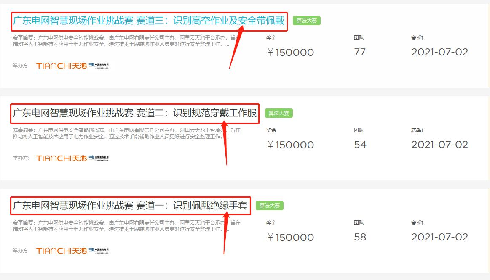

## reflective-clothes-detect-yolov5 and dataset 

* author is leilei
* yolov5 detect qq群: 980489677, qq2群: 710514100
* 数据集下载链接详见说明-Please refer to the instructions for the data set download link!
* [**README_ZN 中文版说明**](https://github.com/gengyanlei/reflective-clothes-detect/blob/master/README_ZN.md)
* [**README_EN English Description**](https://github.com/gengyanlei/reflective-clothes-detect/blob/master/README_EN.md)
* [**tensorRt inference python version**](https://github.com/gengyanlei/onnx2tensorRt)

<!--
### Add competitions !!!
+ [阿里天池比赛-欢迎参加](https://tianchi.aliyun.com/competition/gameList/activeList)

||
|----|
-->

### demo
||
|----|

### Data Label Tool
+ [CVAT](https://github.com/openvinotoolkit/cvat)
+ [CVAT-Tutorial](https://blog.csdn.net/LEILEI18A/article/details/113385510)

## Other
* [building-segmentation-dataset](https://github.com/gengyanlei/build_segmentation_dataset)
* [fire-smoke-detect-datatset](https://github.com/gengyanlei/fire-detect-yolov4)
