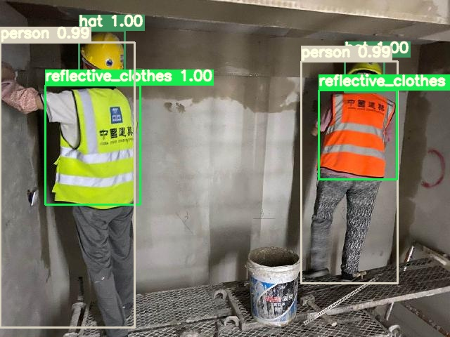

# 施工人员穿戴检测(yolov5)
## 反光衣-安全帽检测数据集

* 作者： leilei
* 施工人员穿戴检测 qq群: 980489677, qq2群: 710514100
* 如果此项目对您有所帮助，请给个star，您的star是对我的鼓励！

### 数据下载细节
* [反光衣检测数据集(1083张，含标注)-百度云盘下载链接](https://pan.baidu.com/s/1_Ei9bYmUpa-8q-hXZk1u8w) 提取码->(dooh)
* 反光衣检测yolov5s模型 直接包含在yolov5文件夹中

### 施工人员穿戴检测可视化
||
|----|

### 反光衣yolov5检测教程
1. 下载反光衣检测数据
2. yolov5s权重已在yolov5文件夹中
3. cd yolov5, 执行如下命令，测试单张图像:
    ```
    python detect.py --source ***/aaa.jpg --weights ./best.pt
    ```
4. 将VOC2021 VOC格式转成yolo格式：
    ```
    调用yolov5中voc_label_Re.py
    ```

### 反光衣检测数据集详情
* 按照Pascal VOC格式:
    ```
    --VOC2021(反光衣)
        --Annotations (xml_num: 1083)
        --ImageSets(Main)
        --JPEGImages (image_num: 1083)

        --images (yolov5 need, the same with JPEGImages)
        --labels (yolov4-5 need)
        --txt_yolov5 (yolov5 need 2021_train.txt)
        --2021_train.txt (yolov4 need)

        --yolov5_weight (yolov5s's weight)

        --label_name: reflective_clothes、other_clothes
    ```

* 百度爬虫代码
    + [crawl.py](https://github.com/gengyanlei/fire-detect-yolov4/tree/master/crawl)

### 实际应用 ###########核心###########
* 基于[SHWD](https://github.com/njvisionpower/Safety-Helmet-Wearing-Dataset)数据集进行安全帽-反光衣-整体人 5类标注训练yolov4-yolov5，实现施工区域or危险区域人员穿戴检测:
    1. 基于1083张反光衣图像训练好的yolov4或yolov5模型，对SHWD数据集进行反光衣类别扩充；
    2. 基于1步骤扩充得到的数据集，训练yolov4.

### 引用
* [SHWD安全帽检测数据集](https://github.com/njvisionpower/Safety-Helmet-Wearing-Dataset)
* [yolov5](https://github.com/ultralytics/yolov5) (支持空label_txt的图像)
* [yolov4](https://github.com/AlexeyAB/darknet) (支持空label_txt的图像)
* [博客blog](https://blog.csdn.net/LEILEI18A/article/details/108694753)

### 郑重声明:
* **本数据仅学术探索！！！**

### 本人构建的其它数据集
* [building-segmentation-dataset](https://github.com/gengyanlei/build_segmentation_dataset)
* [fire-smoke-detect-datatset](https://github.com/gengyanlei/fire-detect-yolov4)
